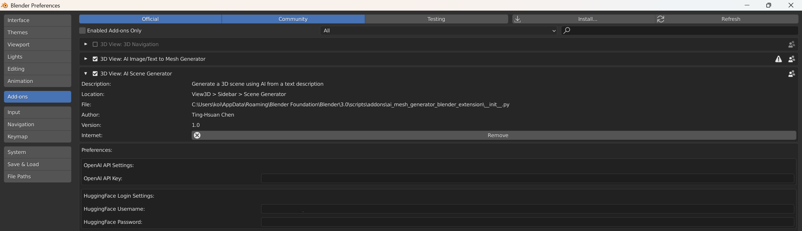
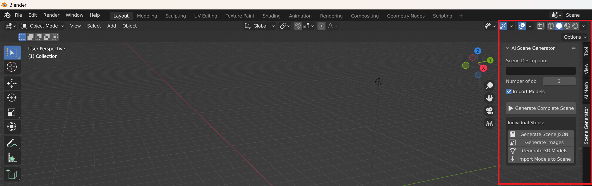
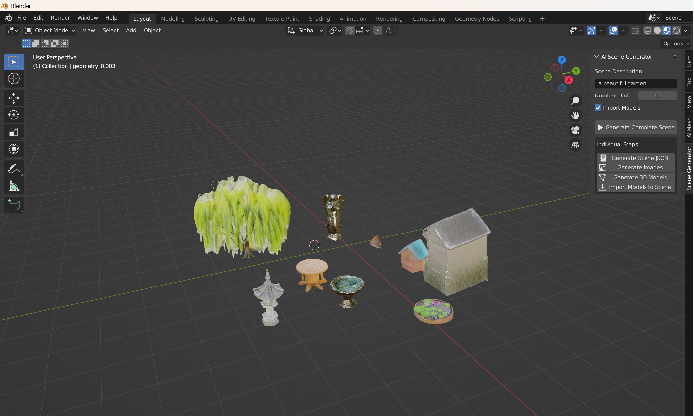

# Rigged Mesh extension addition to below
Inside UniRig, add a 'scene.json' to the directory 'out' and run 'python genmesh.py' to populate the 'out' directory with meshes.

Then similarly run 'bash run_allmeshes.sh' to convert each mesh to a rigged fbx file with the same name, which can be imported to blender.

# AI Scene Generator - Blender Plugin

A Blender plugin that generates complete 3D scenes from text descriptions using AI. This addon allows you to describe a scene and generate 3D models for each object automatically, positioning them according to your description.

## Features

- Generate complete 3D scenes from text descriptions
- Create 3D models for multiple objects in one go
- No CUDA required - works on any system
- High-speed generation using web-based AI models
- Automatic positioning of objects in the scene
- Simple and intuitive UI

## Screenshots

### Preference Settings

### Extension UI

### Results

## Requirements

- Blender 3.0.0 or newer
- Internet connection
- Python packages:
  - openai
  - selenium
  - requests
  - numpy

## Installation

1. Download the latest release ZIP file from the project repository
2. Open Blender and go to Edit > Preferences > Add-ons
3. Click "Install..." and select the downloaded ZIP file
4. Enable the "AI Scene Generator" add-on by checking the box
5. Set up your OpenAI API key and HuggingFace account credentials in the add-on preferences

## Setup

1. In Blender's Preferences > Add-ons, find "AI Scene Generator"
2. Enter your OpenAI API key
3. Enter your HuggingFace login credentials
4. The plugin will automatically install required dependencies if missing

## Usage

1. Open Blender and press `N` to open the sidebar
2. Select the "Scene Generator" tab
3. Enter a description of the scene you want to create
4. Set the number of objects to generate
5. Click "Generate Complete Scene"
6. Wait for processing to complete
7. The generated models will be automatically imported and positioned in your scene

## Scene Description Tips

For best results:
- Be specific in your descriptions
- Describe the scene layout and the objects within it
- Mention colors, materials, and sizes where appropriate
- Example: "A cozy living room with a red sofa, wooden coffee table, and a floor lamp next to a bookshelf"

## Troubleshooting

Common issues:
- **API key errors**: Make sure your OpenAI API key is valid and has sufficient credits
- **HuggingFace login issues**: Verify your username and password
- **Missing dependencies**: To properly install Python dependencies, you'll need to connect your Conda environment with Blender. Follow the tutorial at [Connecting Blender with Conda](https://www.youtube.com/watch?v=gyRoY9QUNg0) for detailed instructions

## Development Team

This plugin was developed by:
- [Ting-Hsuan Chen](https://koi953215.github.io/)
- [Cameron Smith](https://cameronosmith.github.io/)
- [Jiageng Mao](https://pointscoder.github.io/)
- [Daniel Wang](https://dw1209.github.io/)

## Acknowledgments

This project uses:
- OpenAI API for scene description processing
- HuggingFace models for image generation
- Stable Fast 3D for 3D model conversion
- Thanks to all the developers and communities who made these tools available
