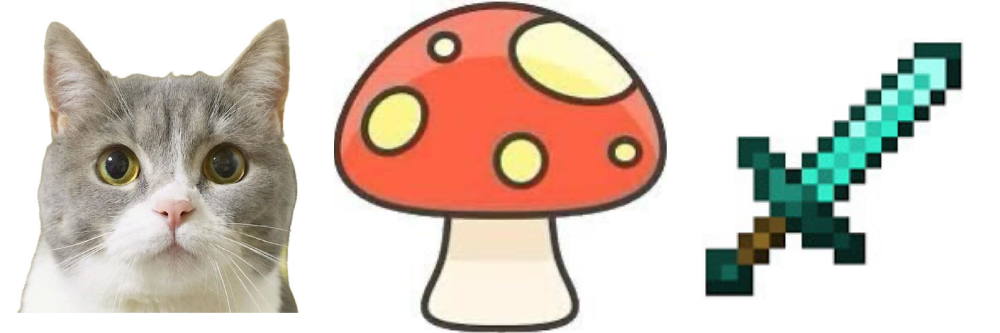

# AI Image/Text to Mesh Generator - Blender Plugin

A Blender plugin that uses AI to convert JPG images or text prompts into 3D mesh models. This plugin integrates the LGM (Latent Gaussian Model) image-to-mesh generation pipeline directly into Blender for a seamless 3D creation workflow.

    

## Demo

Check out our demo video to see the plugin in action:

    

[Watch Demo Video](assets/blender_demo.mp4)

## Features

- Convert JPG images into 3D meshes with a simple interface
- Generate 3D models directly from text prompts
- Direct integration with Blender - no external tools required
- GPU-accelerated processing using CUDA
- Clean user interface with helpful guidelines
- Automatic model import into your Blender scene

## Requirements

- Blender 3.0.0 or newer
- CUDA-compatible GPU

## Installation

1. Compress the entire folder into a ZIP file
2. Open Blender and go to Edit > Preferences > Add-ons
3. Click "Install..." and select the ZIP file you just finished compressing
4. Enable the "AI Image/Text to Mesh Generator" add-on by checking the box

## Usage

1. Open Blender and press `N` to open the sidebar
2. Select the "AI Mesh" tab
3. Choose your input type:
   - **Image**: Click the folder icon to select a JPG image
   - **Text**: Enter a text prompt describing the object you want to create
4. For images, make sure they meet the requirements (clean background, centered object)
5. Click "Generate 3D Model"
6. Wait for processing to complete (time depends on your GPU)
7. The generated model will automatically be imported into your scene

## Image Requirements

For best results when using images:
- Use JPG format only
- Images should have a clean, simple background
- The object should be centered in the image
- Higher resolution images generally produce better results

## Text Prompt Tips

For best results when using text prompts:
- Be specific in your descriptions
- Single objects typically produce better results than complex scenes
- The plugin will automatically generate an image from your text before creating the 3D model

## Troubleshooting

Common issues:
- **Missing dependencies**: Make sure all required Python packages are installed in Blender's Python environment
- **CUDA errors**: Verify that you have a CUDA-compatible GPU and the latest drivers installed
- **Memory errors**: If you encounter GPU memory errors, try using smaller images or closing other GPU-intensive applications

## Development Team

This plugin was developed by:
- [Ting-Hsuan Chen](https://koi953215.github.io/)
- [Cameron Smith](https://cameronosmith.github.io/)
- [Jiageng Mao](https://pointscoder.github.io/)
- [Daniel Wang](https://dw1209.github.io/)

## Acknowledgments

This project uses the LGM model for image-to-mesh generation and Stable Diffusion for text-to-image generation. We thank the original authors for making their work available.